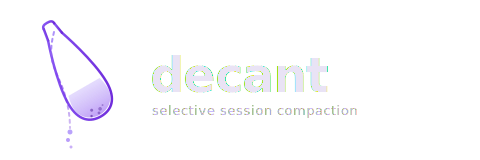

<p align="center">
  
</p>

<p align="center">
  
  <a href="https://github.com/TKasperczyk/decant"></a>
  
  <a href="https://github.com/TKasperczyk/decant/blob/main/LICENSE"></a>
</p>

---

Selective offline compaction for Claude Code sessions. You choose a split point — by topic or by count — and decant summarizes everything before it while keeping the rest intact. The output matches Claude Code's native format, so `claude --resume` just works.

Unlike the built-in compaction, which summarizes the entire session, decant lets you preserve recent context and only compress the old parts. Pick a topic ("keep everything about the API refactor") or a count ("keep the last 5 exchanges") and it handles the rest.

## Install

```bash
git clone https://github.com/TKasperczyk/decant.git
cd decant
python -m venv .venv
source .venv/bin/activate
pip install -e .
```

## Usage

### List sessions

```bash
decant list
decant list --project claude-memory
```

### Preview a session's exchanges

```bash
decant show <session-id>
decant show <session-id> --full
```

### Compact by topic

Keep everything from a topic onward, summarize everything before it:

```bash
decant compact <session-id> --topic "API refactor"
decant compact <session-id> --topic "the bug fix" --model sonnet
```

### Compact by count

Keep the last N user turns, summarize the rest:

```bash
decant compact <session-id> --last 5
decant compact <session-id> --last 10 --model opus
```

### Options

- `--model haiku|sonnet|opus` - which model to use for boundary finding and summarization (default: haiku)
- `--strip` - remove noise (progress ticks, thinking blocks, metadata, oversized tool output) before compaction
- `--dry-run` - preview what would happen without touching anything
- `--no-backup` - skip creating a `.bak` file (not recommended)

Session IDs can be the full UUID, a prefix (minimum 6 chars), or a direct path to a `.jsonl` file.

## How it works

1. Parses the session JSONL and reconstructs the conversation tree via `parentUuid` chains
2. Finds the boundary message, either by asking an LLM to locate a topic, or by counting user turns from the end
3. Optionally strips noise (progress ticks, thinking blocks, metadata, oversized tool output)
4. Sends the head section to the LLM for summarization
5. Writes a summary record matching Claude Code's native format (`{type, summary, leafUuid}`)
6. Sets the boundary message as the new tree root (`parentUuid: null`)
7. Drops all head messages and their sidechains, keeps everything from the boundary forward

A timestamped backup is created before any modifications.

## Authentication

Decant needs Anthropic API access for the LLM calls. It checks these in order:

1. `ANTHROPIC_API_KEY` or `OPENCODE_API_KEY` environment variable
2. `ANTHROPIC_AUTH_TOKEN` environment variable
3. Claude Code OAuth credentials (`~/.claude/.credentials.json`)

If you're already authenticated with Claude Code, it just works. Decant reuses those credentials with automatic token refresh.

## Why "decant"?

You're pouring the conversation through a filter. The clear, recent context comes through. The sediment stays behind as a summary.
